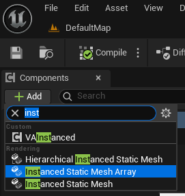
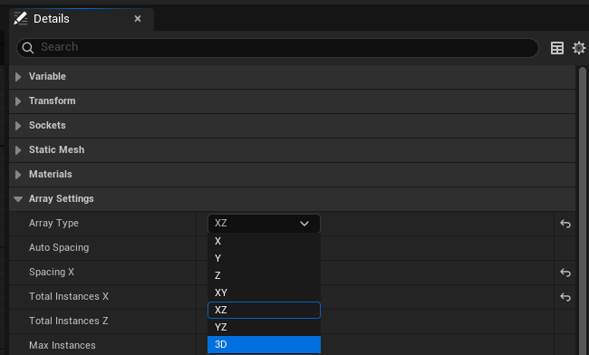
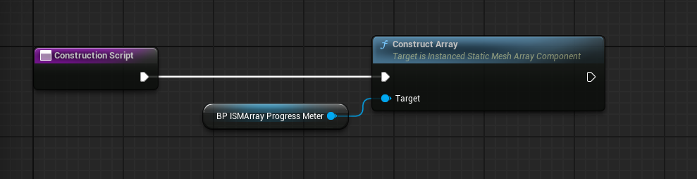
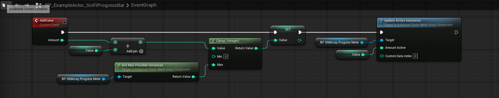
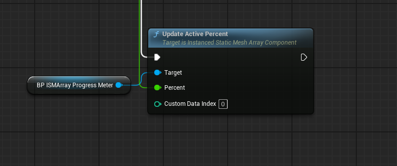
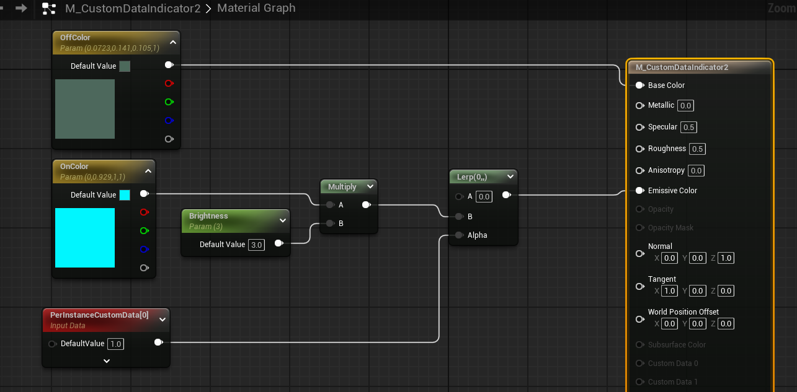
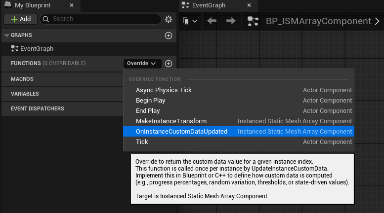
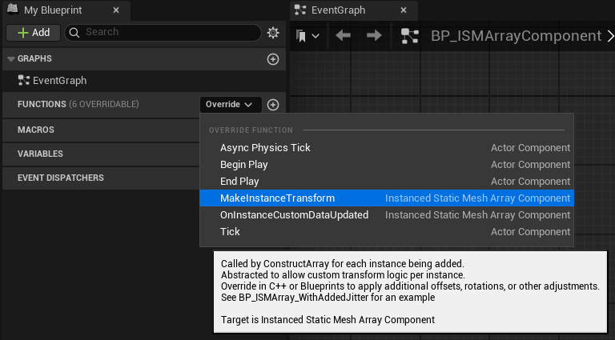
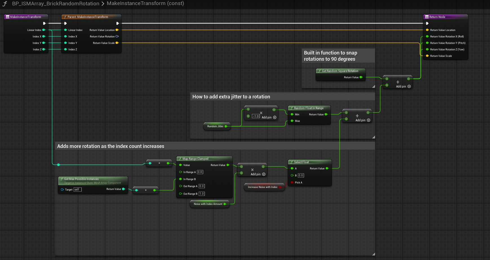

@import url(https://themes.googleusercontent.com/fonts/css?kit=MXVwpSGzOOhqOc5hUWJbBLizfYjsfH9XaeDpmRKYJN5bV0WvE1cEyAoIq5yYZlSc);ul.lst-kix\_8od25t6xlw7y-6{list-style-type:none}ul.lst-kix\_8od25t6xlw7y-7{list-style-type:none}ul.lst-kix\_8od25t6xlw7y-8{list-style-type:none}ul.lst-kix\_8od25t6xlw7y-0{list-style-type:none}ul.lst-kix\_8od25t6xlw7y-1{list-style-type:none}ul.lst-kix\_8od25t6xlw7y-2{list-style-type:none}ul.lst-kix\_8od25t6xlw7y-3{list-style-type:none}.lst-kix\_5tydpzfbemt2-7>li:before{content:"\\0025cb "}.lst-kix\_5tydpzfbemt2-8>li:before{content:"\\0025a0 "}ul.lst-kix\_8od25t6xlw7y-4{list-style-type:none}ul.lst-kix\_8od25t6xlw7y-5{list-style-type:none}.lst-kix\_8od25t6xlw7y-0>li:before{content:"\\0025cf "}.lst-kix\_8od25t6xlw7y-1>li:before{content:"\\0025cb "}.lst-kix\_8od25t6xlw7y-4>li:before{content:"\\0025cb "}ol.lst-kix\_yhu3zcsdsnv3-8{list-style-type:none}ul.lst-kix\_h15cfv6jx0h2-3{list-style-type:none}ol.lst-kix\_1bwc2v8jxnx0-0.start{counter-reset:lst-ctn-kix\_1bwc2v8jxnx0-0 0}.lst-kix\_8od25t6xlw7y-2>li:before{content:"\\0025a0 "}.lst-kix\_8od25t6xlw7y-3>li:before{content:"\\0025cf "}ul.lst-kix\_h15cfv6jx0h2-2{list-style-type:none}ul.lst-kix\_h15cfv6jx0h2-1{list-style-type:none}ul.lst-kix\_h15cfv6jx0h2-0{list-style-type:none}ol.lst-kix\_yhu3zcsdsnv3-4{list-style-type:none}ol.lst-kix\_yhu3zcsdsnv3-5{list-style-type:none}.lst-kix\_8od25t6xlw7y-8>li:before{content:"\\0025a0 "}ol.lst-kix\_yhu3zcsdsnv3-6{list-style-type:none}ol.lst-kix\_yhu3zcsdsnv3-7{list-style-type:none}ol.lst-kix\_yhu3zcsdsnv3-0{list-style-type:none}ol.lst-kix\_yhu3zcsdsnv3-1{list-style-type:none}ol.lst-kix\_yhu3zcsdsnv3-2{list-style-type:none}ol.lst-kix\_yhu3zcsdsnv3-3{list-style-type:none}.lst-kix\_8od25t6xlw7y-5>li:before{content:"\\0025a0 "}.lst-kix\_8od25t6xlw7y-6>li:before{content:"\\0025cf "}.lst-kix\_8od25t6xlw7y-7>li:before{content:"\\0025cb "}ul.lst-kix\_1kz95rtw3rz-7{list-style-type:none}ul.lst-kix\_1kz95rtw3rz-8{list-style-type:none}ul.lst-kix\_1kz95rtw3rz-5{list-style-type:none}ul.lst-kix\_1kz95rtw3rz-6{list-style-type:none}ol.lst-kix\_yhu3zcsdsnv3-5.start{counter-reset:lst-ctn-kix\_yhu3zcsdsnv3-5 0}ul.lst-kix\_1kz95rtw3rz-3{list-style-type:none}ul.lst-kix\_1kz95rtw3rz-4{list-style-type:none}ul.lst-kix\_1kz95rtw3rz-1{list-style-type:none}ul.lst-kix\_1kz95rtw3rz-2{list-style-type:none}ol.lst-kix\_saxq2qwfmrh0-2.start{counter-reset:lst-ctn-kix\_saxq2qwfmrh0-2 0}ul.lst-kix\_1kz95rtw3rz-0{list-style-type:none}.lst-kix\_folhmf1itrxt-1>li:before{content:"\\0025cb "}ol.lst-kix\_1bwc2v8jxnx0-5.start{counter-reset:lst-ctn-kix\_1bwc2v8jxnx0-5 0}.lst-kix\_folhmf1itrxt-3>li:before{content:"\\0025cf "}.lst-kix\_folhmf1itrxt-2>li:before{content:"\\0025a0 "}.lst-kix\_folhmf1itrxt-5>li:before{content:"\\0025a0 "}ul.lst-kix\_lm9cq2ja131z-8{list-style-type:none}ul.lst-kix\_lm9cq2ja131z-7{list-style-type:none}ul.lst-kix\_lm9cq2ja131z-6{list-style-type:none}ul.lst-kix\_lm9cq2ja131z-5{list-style-type:none}ul.lst-kix\_lm9cq2ja131z-4{list-style-type:none}.lst-kix\_folhmf1itrxt-4>li:before{content:"\\0025cb "}ul.lst-kix\_lm9cq2ja131z-3{list-style-type:none}.lst-kix\_saxq2qwfmrh0-2>li{counter-increment:lst-ctn-kix\_saxq2qwfmrh0-2}ul.lst-kix\_lm9cq2ja131z-2{list-style-type:none}ul.lst-kix\_lm9cq2ja131z-1{list-style-type:none}ul.lst-kix\_lm9cq2ja131z-0{list-style-type:none}.lst-kix\_1bwc2v8jxnx0-3>li{counter-increment:lst-ctn-kix\_1bwc2v8jxnx0-3}.lst-kix\_folhmf1itrxt-7>li:before{content:"\\0025cb "}.lst-kix\_51mywfl9l4is-2>li:before{content:"\\0025a0 "}.lst-kix\_folhmf1itrxt-6>li:before{content:"\\0025cf "}.lst-kix\_51mywfl9l4is-1>li:before{content:"\\0025cb "}.lst-kix\_51mywfl9l4is-0>li:before{content:"\\0025cf "}.lst-kix\_folhmf1itrxt-8>li:before{content:"\\0025a0 "}.lst-kix\_51mywfl9l4is-7>li:before{content:"\\0025cb "}ul.lst-kix\_h15cfv6jx0h2-7{list-style-type:none}ul.lst-kix\_h15cfv6jx0h2-6{list-style-type:none}ul.lst-kix\_h15cfv6jx0h2-5{list-style-type:none}ul.lst-kix\_h15cfv6jx0h2-4{list-style-type:none}.lst-kix\_51mywfl9l4is-6>li:before{content:"\\0025cf "}ul.lst-kix\_h15cfv6jx0h2-8{list-style-type:none}.lst-kix\_51mywfl9l4is-3>li:before{content:"\\0025cf "}.lst-kix\_5tydpzfbemt2-1>li:before{content:"\\0025cb "}.lst-kix\_51mywfl9l4is-5>li:before{content:"\\0025a0 "}.lst-kix\_5tydpzfbemt2-0>li:before{content:"\\0025cf "}.lst-kix\_51mywfl9l4is-4>li:before{content:"\\0025cb "}.lst-kix\_5tydpzfbemt2-5>li:before{content:"\\0025a0 "}.lst-kix\_5tydpzfbemt2-6>li:before{content:"\\0025cf "}.lst-kix\_5tydpzfbemt2-2>li:before{content:"\\0025a0 "}.lst-kix\_yhu3zcsdsnv3-4>li{counter-increment:lst-ctn-kix\_yhu3zcsdsnv3-4}.lst-kix\_5tydpzfbemt2-3>li:before{content:"\\0025cf "}.lst-kix\_5tydpzfbemt2-4>li:before{content:"\\0025cb "}.lst-kix\_folhmf1itrxt-0>li:before{content:"\\0025cf "}.lst-kix\_51mywfl9l4is-8>li:before{content:"\\0025a0 "}.lst-kix\_ht2zxae779ou-1>li:before{content:"\\0025cb "}.lst-kix\_ht2zxae779ou-3>li:before{content:"\\0025cf "}ol.lst-kix\_1bwc2v8jxnx0-7.start{counter-reset:lst-ctn-kix\_1bwc2v8jxnx0-7 0}.lst-kix\_saxq2qwfmrh0-5>li{counter-increment:lst-ctn-kix\_saxq2qwfmrh0-5}.lst-kix\_7ri8pu42vwv3-3>li:before{content:"\\0025cf "}ol.lst-kix\_saxq2qwfmrh0-0{list-style-type:none}.lst-kix\_7ri8pu42vwv3-1>li:before{content:"\\0025cb "}ol.lst-kix\_saxq2qwfmrh0-2{list-style-type:none}.lst-kix\_ht2zxae779ou-7>li:before{content:"\\0025cb "}ol.lst-kix\_saxq2qwfmrh0-1{list-style-type:none}ol.lst-kix\_saxq2qwfmrh0-4{list-style-type:none}ol.lst-kix\_saxq2qwfmrh0-3{list-style-type:none}.lst-kix\_ht2zxae779ou-5>li:before{content:"\\0025a0 "}.lst-kix\_2sem5ciezr7o-5>li:before{content:"\\0025a0 "}.lst-kix\_saxq2qwfmrh0-6>li{counter-increment:lst-ctn-kix\_saxq2qwfmrh0-6}.lst-kix\_2sem5ciezr7o-7>li:before{content:"\\0025cb "}ol.lst-kix\_saxq2qwfmrh0-6{list-style-type:none}ol.lst-kix\_saxq2qwfmrh0-5{list-style-type:none}.lst-kix\_3qa10i6shdf3-3>li:before{content:"\\0025cf "}ol.lst-kix\_saxq2qwfmrh0-8{list-style-type:none}ol.lst-kix\_saxq2qwfmrh0-7{list-style-type:none}.lst-kix\_3qa10i6shdf3-5>li:before{content:"\\0025a0 "}.lst-kix\_saxq2qwfmrh0-7>li:before{content:"" counter(lst-ctn-kix\_saxq2qwfmrh0-7,lower-latin) ". "}.lst-kix\_3qa10i6shdf3-7>li:before{content:"\\0025cb "}.lst-kix\_saxq2qwfmrh0-5>li:before{content:"" counter(lst-ctn-kix\_saxq2qwfmrh0-5,lower-roman) ". "}.lst-kix\_1bwc2v8jxnx0-5>li:before{content:"" counter(lst-ctn-kix\_1bwc2v8jxnx0-5,lower-roman) ". "}.lst-kix\_1bwc2v8jxnx0-7>li:before{content:"" counter(lst-ctn-kix\_1bwc2v8jxnx0-7,lower-latin) ". "}.lst-kix\_f5y7afpcrmno-7>li:before{content:"\\0025cb "}.lst-kix\_e7pzjze3nv4b-4>li:before{content:"\\0025cb "}ul.lst-kix\_j70ud97bit1-5{list-style-type:none}ul.lst-kix\_j70ud97bit1-6{list-style-type:none}.lst-kix\_saxq2qwfmrh0-1>li:before{content:"" counter(lst-ctn-kix\_saxq2qwfmrh0-1,lower-latin) ". "}.lst-kix\_1bwc2v8jxnx0-1>li:before{content:"" counter(lst-ctn-kix\_1bwc2v8jxnx0-1,lower-latin) ". "}ul.lst-kix\_j70ud97bit1-7{list-style-type:none}ul.lst-kix\_j70ud97bit1-8{list-style-type:none}.lst-kix\_f5y7afpcrmno-5>li:before{content:"\\0025a0 "}.lst-kix\_saxq2qwfmrh0-3>li:before{content:"" counter(lst-ctn-kix\_saxq2qwfmrh0-3,decimal) ". "}.lst-kix\_e7pzjze3nv4b-6>li:before{content:"\\0025cf "}.lst-kix\_yhu3zcsdsnv3-8>li{counter-increment:lst-ctn-kix\_yhu3zcsdsnv3-8}.lst-kix\_1bwc2v8jxnx0-3>li:before{content:"" counter(lst-ctn-kix\_1bwc2v8jxnx0-3,decimal) ". "}.lst-kix\_f5y7afpcrmno-1>li:before{content:"\\0025cb "}.lst-kix\_e7pzjze3nv4b-8>li:before{content:"\\0025a0 "}.lst-kix\_3qa10i6shdf3-1>li:before{content:"\\0025cb "}.lst-kix\_f5y7afpcrmno-3>li:before{content:"\\0025cf "}.lst-kix\_2sem5ciezr7o-1>li:before{content:"\\0025cb "}.lst-kix\_yhu3zcsdsnv3-3>li:before{content:"" counter(lst-ctn-kix\_yhu3zcsdsnv3-3,decimal) ". "}.lst-kix\_yhu3zcsdsnv3-5>li:before{content:"" counter(lst-ctn-kix\_yhu3zcsdsnv3-5,lower-roman) ". "}.lst-kix\_yhu3zcsdsnv3-7>li:before{content:"" counter(lst-ctn-kix\_yhu3zcsdsnv3-7,lower-latin) ". "}ul.lst-kix\_e7pzjze3nv4b-0{list-style-type:none}.lst-kix\_2sem5ciezr7o-3>li:before{content:"\\0025cf "}ul.lst-kix\_e7pzjze3nv4b-5{list-style-type:none}ul.lst-kix\_e7pzjze3nv4b-6{list-style-type:none}ul.lst-kix\_e7pzjze3nv4b-7{list-style-type:none}ul.lst-kix\_e7pzjze3nv4b-8{list-style-type:none}.lst-kix\_7ri8pu42vwv3-5>li:before{content:"\\0025a0 "}ul.lst-kix\_e7pzjze3nv4b-1{list-style-type:none}ol.lst-kix\_saxq2qwfmrh0-7.start{counter-reset:lst-ctn-kix\_saxq2qwfmrh0-7 0}ul.lst-kix\_e7pzjze3nv4b-2{list-style-type:none}ul.lst-kix\_e7pzjze3nv4b-3{list-style-type:none}ul.lst-kix\_e7pzjze3nv4b-4{list-style-type:none}ul.lst-kix\_j70ud97bit1-1{list-style-type:none}.lst-kix\_7ri8pu42vwv3-7>li:before{content:"\\0025cb "}.lst-kix\_e7pzjze3nv4b-0>li:before{content:"\\0025cf "}ul.lst-kix\_j70ud97bit1-2{list-style-type:none}ul.lst-kix\_j70ud97bit1-3{list-style-type:none}ul.lst-kix\_j70ud97bit1-4{list-style-type:none}.lst-kix\_yhu3zcsdsnv3-1>li:before{content:"" counter(lst-ctn-kix\_yhu3zcsdsnv3-1,lower-latin) ". "}ol.lst-kix\_yhu3zcsdsnv3-7.start{counter-reset:lst-ctn-kix\_yhu3zcsdsnv3-7 0}.lst-kix\_e7pzjze3nv4b-2>li:before{content:"\\0025a0 "}ul.lst-kix\_j70ud97bit1-0{list-style-type:none}.lst-kix\_jvo528zh3roc-8>li:before{content:"\\0025a0 "}ul.lst-kix\_ht2zxae779ou-1{list-style-type:none}.lst-kix\_yhu3zcsdsnv3-5>li{counter-increment:lst-ctn-kix\_yhu3zcsdsnv3-5}ul.lst-kix\_ht2zxae779ou-0{list-style-type:none}ul.lst-kix\_ht2zxae779ou-5{list-style-type:none}ul.lst-kix\_ht2zxae779ou-4{list-style-type:none}ul.lst-kix\_ht2zxae779ou-3{list-style-type:none}.lst-kix\_1bwc2v8jxnx0-0>li{counter-increment:lst-ctn-kix\_1bwc2v8jxnx0-0}ul.lst-kix\_ht2zxae779ou-2{list-style-type:none}ul.lst-kix\_ht2zxae779ou-8{list-style-type:none}ul.lst-kix\_ht2zxae779ou-7{list-style-type:none}ul.lst-kix\_ht2zxae779ou-6{list-style-type:none}.lst-kix\_yhu3zcsdsnv3-3>li{counter-increment:lst-ctn-kix\_yhu3zcsdsnv3-3}.lst-kix\_4w8segzhuww-7>li:before{content:"\\0025cb "}.lst-kix\_4w8segzhuww-8>li:before{content:"\\0025a0 "}.lst-kix\_8lbbz4psgmla-3>li:before{content:"\\0025cf "}.lst-kix\_8lbbz4psgmla-2>li:before{content:"\\0025a0 "}.lst-kix\_4w8segzhuww-0>li:before{content:"\\0025cf "}.lst-kix\_saxq2qwfmrh0-1>li{counter-increment:lst-ctn-kix\_saxq2qwfmrh0-1}.lst-kix\_4w8segzhuww-3>li:before{content:"\\0025cf "}.lst-kix\_4w8segzhuww-4>li:before{content:"\\0025cb "}.lst-kix\_1bwc2v8jxnx0-2>li{counter-increment:lst-ctn-kix\_1bwc2v8jxnx0-2}ol.lst-kix\_yhu3zcsdsnv3-2.start{counter-reset:lst-ctn-kix\_yhu3zcsdsnv3-2 0}.lst-kix\_1kz95rtw3rz-0>li:before{content:"\\0025cf "}.lst-kix\_h15cfv6jx0h2-0>li:before{content:"\\0025cf "}.lst-kix\_j70ud97bit1-2>li:before{content:"\\0025a0 "}ol.lst-kix\_yhu3zcsdsnv3-3.start{counter-reset:lst-ctn-kix\_yhu3zcsdsnv3-3 0}.lst-kix\_j70ud97bit1-3>li:before{content:"\\0025cf "}.lst-kix\_jvo528zh3roc-0>li:before{content:"\\0025cf "}.lst-kix\_1kz95rtw3rz-8>li:before{content:"\\0025a0 "}.lst-kix\_8lbbz4psgmla-6>li:before{content:"\\0025cf "}.lst-kix\_h15cfv6jx0h2-8>li:before{content:"\\0025a0 "}.lst-kix\_8lbbz4psgmla-7>li:before{content:"\\0025cb "}.lst-kix\_1kz95rtw3rz-1>li:before{content:"\\0025cb "}.lst-kix\_jvo528zh3roc-7>li:before{content:"\\0025cb "}ul.lst-kix\_2vxf78mzeew9-2{list-style-type:none}.lst-kix\_h15cfv6jx0h2-3>li:before{content:"\\0025cf "}ul.lst-kix\_2vxf78mzeew9-1{list-style-type:none}ul.lst-kix\_2vxf78mzeew9-0{list-style-type:none}ul.lst-kix\_2vxf78mzeew9-6{list-style-type:none}.lst-kix\_h15cfv6jx0h2-4>li:before{content:"\\0025cb "}ul.lst-kix\_2vxf78mzeew9-5{list-style-type:none}ul.lst-kix\_2vxf78mzeew9-4{list-style-type:none}ul.lst-kix\_2vxf78mzeew9-3{list-style-type:none}.lst-kix\_saxq2qwfmrh0-8>li{counter-increment:lst-ctn-kix\_saxq2qwfmrh0-8}.lst-kix\_jvo528zh3roc-4>li:before{content:"\\0025cb "}.lst-kix\_yhu3zcsdsnv3-7>li{counter-increment:lst-ctn-kix\_yhu3zcsdsnv3-7}.lst-kix\_h15cfv6jx0h2-7>li:before{content:"\\0025cb "}.lst-kix\_1kz95rtw3rz-4>li:before{content:"\\0025cb "}ul.lst-kix\_2vxf78mzeew9-8{list-style-type:none}ul.lst-kix\_2vxf78mzeew9-7{list-style-type:none}.lst-kix\_1kz95rtw3rz-5>li:before{content:"\\0025a0 "}.lst-kix\_jvo528zh3roc-3>li:before{content:"\\0025cf "}.lst-kix\_ht2zxae779ou-0>li:before{content:"\\0025cf "}ol.lst-kix\_yhu3zcsdsnv3-1.start{counter-reset:lst-ctn-kix\_yhu3zcsdsnv3-1 0}.lst-kix\_2sem5ciezr7o-8>li:before{content:"\\0025a0 "}.lst-kix\_ht2zxae779ou-8>li:before{content:"\\0025a0 "}ul.lst-kix\_t3e6r2awtsnp-1{list-style-type:none}.lst-kix\_7ri8pu42vwv3-2>li:before{content:"\\0025a0 "}ul.lst-kix\_t3e6r2awtsnp-0{list-style-type:none}ul.lst-kix\_t3e6r2awtsnp-3{list-style-type:none}ul.lst-kix\_t3e6r2awtsnp-2{list-style-type:none}ul.lst-kix\_t3e6r2awtsnp-5{list-style-type:none}.lst-kix\_ht2zxae779ou-4>li:before{content:"\\0025cb "}ul.lst-kix\_t3e6r2awtsnp-4{list-style-type:none}ul.lst-kix\_t3e6r2awtsnp-7{list-style-type:none}ul.lst-kix\_t3e6r2awtsnp-6{list-style-type:none}ul.lst-kix\_t3e6r2awtsnp-8{list-style-type:none}.lst-kix\_j70ud97bit1-6>li:before{content:"\\0025cf "}.lst-kix\_t3e6r2awtsnp-2>li:before{content:"\\0025a0 "}.lst-kix\_yhu3zcsdsnv3-0>li{counter-increment:lst-ctn-kix\_yhu3zcsdsnv3-0}.lst-kix\_lm9cq2ja131z-2>li:before{content:"\\0025a0 "}.lst-kix\_lm9cq2ja131z-6>li:before{content:"\\0025cf "}ul.lst-kix\_7ri8pu42vwv3-8{list-style-type:none}ul.lst-kix\_7ri8pu42vwv3-7{list-style-type:none}ul.lst-kix\_7ri8pu42vwv3-6{list-style-type:none}ul.lst-kix\_7ri8pu42vwv3-5{list-style-type:none}ul.lst-kix\_7ri8pu42vwv3-4{list-style-type:none}.lst-kix\_3qa10i6shdf3-6>li:before{content:"\\0025cf "}ul.lst-kix\_7ri8pu42vwv3-3{list-style-type:none}.lst-kix\_1bwc2v8jxnx0-8>li:before{content:"" counter(lst-ctn-kix\_1bwc2v8jxnx0-8,lower-roman) ". "}ul.lst-kix\_7ri8pu42vwv3-2{list-style-type:none}ul.lst-kix\_7ri8pu42vwv3-1{list-style-type:none}ul.lst-kix\_7ri8pu42vwv3-0{list-style-type:none}.lst-kix\_saxq2qwfmrh0-6>li:before{content:"" counter(lst-ctn-kix\_saxq2qwfmrh0-6,decimal) ". "}.lst-kix\_1bwc2v8jxnx0-0>li:before{content:"" counter(lst-ctn-kix\_1bwc2v8jxnx0-0,decimal) ". "}.lst-kix\_f5y7afpcrmno-6>li:before{content:"\\0025cf "}.lst-kix\_e7pzjze3nv4b-5>li:before{content:"\\0025a0 "}.lst-kix\_1bwc2v8jxnx0-4>li:before{content:"" counter(lst-ctn-kix\_1bwc2v8jxnx0-4,lower-latin) ". "}.lst-kix\_saxq2qwfmrh0-2>li:before{content:"" counter(lst-ctn-kix\_saxq2qwfmrh0-2,lower-roman) ". "}.lst-kix\_3qa10i6shdf3-2>li:before{content:"\\0025a0 "}.lst-kix\_f5y7afpcrmno-2>li:before{content:"\\0025a0 "}.lst-kix\_saxq2qwfmrh0-3>li{counter-increment:lst-ctn-kix\_saxq2qwfmrh0-3}.lst-kix\_2sem5ciezr7o-0>li:before{content:"\\0025cf "}.lst-kix\_1bwc2v8jxnx0-7>li{counter-increment:lst-ctn-kix\_1bwc2v8jxnx0-7}.lst-kix\_2sem5ciezr7o-4>li:before{content:"\\0025cb "}ol.lst-kix\_yhu3zcsdsnv3-0.start{counter-reset:lst-ctn-kix\_yhu3zcsdsnv3-0 0}.lst-kix\_yhu3zcsdsnv3-6>li:before{content:"" counter(lst-ctn-kix\_yhu3zcsdsnv3-6,decimal) ". "}.lst-kix\_2vxf78mzeew9-3>li:before{content:"\\0025cf "}.lst-kix\_2vxf78mzeew9-7>li:before{content:"\\0025cb "}.lst-kix\_7ri8pu42vwv3-6>li:before{content:"\\0025cf "}.lst-kix\_e7pzjze3nv4b-1>li:before{content:"\\0025cb "}.lst-kix\_yhu3zcsdsnv3-2>li:before{content:"" counter(lst-ctn-kix\_yhu3zcsdsnv3-2,lower-roman) ". "}ul.lst-kix\_folhmf1itrxt-0{list-style-type:none}.lst-kix\_2vxf78mzeew9-1>li:before{content:"\\0025cb "}.lst-kix\_2vxf78mzeew9-0>li:before{content:"\\0025cf "}.lst-kix\_2vxf78mzeew9-2>li:before{content:"\\0025a0 "}ul.lst-kix\_f5y7afpcrmno-8{list-style-type:none}ul.lst-kix\_f5y7afpcrmno-1{list-style-type:none}ul.lst-kix\_folhmf1itrxt-4{list-style-type:none}ul.lst-kix\_f5y7afpcrmno-0{list-style-type:none}ul.lst-kix\_folhmf1itrxt-3{list-style-type:none}ul.lst-kix\_f5y7afpcrmno-3{list-style-type:none}ul.lst-kix\_folhmf1itrxt-2{list-style-type:none}ul.lst-kix\_f5y7afpcrmno-2{list-style-type:none}ul.lst-kix\_folhmf1itrxt-1{list-style-type:none}ul.lst-kix\_f5y7afpcrmno-5{list-style-type:none}ul.lst-kix\_folhmf1itrxt-8{list-style-type:none}ul.lst-kix\_f5y7afpcrmno-4{list-style-type:none}ul.lst-kix\_folhmf1itrxt-7{list-style-type:none}ul.lst-kix\_f5y7afpcrmno-7{list-style-type:none}ol.lst-kix\_saxq2qwfmrh0-8.start{counter-reset:lst-ctn-kix\_saxq2qwfmrh0-8 0}ul.lst-kix\_folhmf1itrxt-6{list-style-type:none}ul.lst-kix\_f5y7afpcrmno-6{list-style-type:none}ul.lst-kix\_folhmf1itrxt-5{list-style-type:none}.lst-kix\_yhu3zcsdsnv3-6>li{counter-increment:lst-ctn-kix\_yhu3zcsdsnv3-6}.lst-kix\_yc6rgi6nk4or-4>li:before{content:"\\0025cb "}.lst-kix\_yc6rgi6nk4or-5>li:before{content:"\\0025a0 "}.lst-kix\_yc6rgi6nk4or-6>li:before{content:"\\0025cf "}ul.lst-kix\_2sem5ciezr7o-0{list-style-type:none}ul.lst-kix\_2sem5ciezr7o-1{list-style-type:none}ul.lst-kix\_2sem5ciezr7o-2{list-style-type:none}.lst-kix\_yc6rgi6nk4or-7>li:before{content:"\\0025cb "}.lst-kix\_t3e6r2awtsnp-8>li:before{content:"\\0025a0 "}ul.lst-kix\_2sem5ciezr7o-3{list-style-type:none}ul.lst-kix\_2sem5ciezr7o-4{list-style-type:none}ul.lst-kix\_2sem5ciezr7o-5{list-style-type:none}ol.lst-kix\_saxq2qwfmrh0-3.start{counter-reset:lst-ctn-kix\_saxq2qwfmrh0-3 0}ul.lst-kix\_2sem5ciezr7o-6{list-style-type:none}.lst-kix\_t3e6r2awtsnp-6>li:before{content:"\\0025cf "}.lst-kix\_t3e6r2awtsnp-7>li:before{content:"\\0025cb "}ul.lst-kix\_2sem5ciezr7o-7{list-style-type:none}ul.lst-kix\_2sem5ciezr7o-8{list-style-type:none}.lst-kix\_yc6rgi6nk4or-8>li:before{content:"\\0025a0 "}.lst-kix\_t3e6r2awtsnp-5>li:before{content:"\\0025a0 "}ol.lst-kix\_yhu3zcsdsnv3-4.start{counter-reset:lst-ctn-kix\_yhu3zcsdsnv3-4 0}ol.lst-kix\_1bwc2v8jxnx0-6.start{counter-reset:lst-ctn-kix\_1bwc2v8jxnx0-6 0}.lst-kix\_yc6rgi6nk4or-3>li:before{content:"\\0025cf "}.lst-kix\_yc6rgi6nk4or-1>li:before{content:"\\0025cb "}.lst-kix\_yc6rgi6nk4or-2>li:before{content:"\\0025a0 "}.lst-kix\_yc6rgi6nk4or-0>li:before{content:"\\0025cf "}ul.lst-kix\_jvo528zh3roc-8{list-style-type:none}ul.lst-kix\_yc6rgi6nk4or-0{list-style-type:none}ul.lst-kix\_yc6rgi6nk4or-4{list-style-type:none}ul.lst-kix\_yc6rgi6nk4or-3{list-style-type:none}ul.lst-kix\_yc6rgi6nk4or-2{list-style-type:none}ul.lst-kix\_4w8segzhuww-1{list-style-type:none}ul.lst-kix\_yc6rgi6nk4or-1{list-style-type:none}ul.lst-kix\_4w8segzhuww-0{list-style-type:none}ul.lst-kix\_yc6rgi6nk4or-8{list-style-type:none}ul.lst-kix\_4w8segzhuww-3{list-style-type:none}ul.lst-kix\_yc6rgi6nk4or-7{list-style-type:none}ul.lst-kix\_4w8segzhuww-2{list-style-type:none}ul.lst-kix\_yc6rgi6nk4or-6{list-style-type:none}ul.lst-kix\_4w8segzhuww-5{list-style-type:none}ul.lst-kix\_yc6rgi6nk4or-5{list-style-type:none}ul.lst-kix\_4w8segzhuww-4{list-style-type:none}ul.lst-kix\_4w8segzhuww-7{list-style-type:none}ul.lst-kix\_4w8segzhuww-6{list-style-type:none}ul.lst-kix\_4w8segzhuww-8{list-style-type:none}.lst-kix\_lm9cq2ja131z-1>li:before{content:"\\0025cb "}.lst-kix\_t3e6r2awtsnp-3>li:before{content:"\\0025cf "}.lst-kix\_j70ud97bit1-5>li:before{content:"\\0025a0 "}.lst-kix\_j70ud97bit1-7>li:before{content:"\\0025cb "}.lst-kix\_lm9cq2ja131z-3>li:before{content:"\\0025cf "}ol.lst-kix\_saxq2qwfmrh0-6.start{counter-reset:lst-ctn-kix\_saxq2qwfmrh0-6 0}ul.lst-kix\_3qa10i6shdf3-2{list-style-type:none}ul.lst-kix\_3qa10i6shdf3-3{list-style-type:none}ul.lst-kix\_3qa10i6shdf3-0{list-style-type:none}ul.lst-kix\_3qa10i6shdf3-1{list-style-type:none}.lst-kix\_t3e6r2awtsnp-1>li:before{content:"\\0025cb "}.lst-kix\_lm9cq2ja131z-5>li:before{content:"\\0025a0 "}.lst-kix\_saxq2qwfmrh0-7>li{counter-increment:lst-ctn-kix\_saxq2qwfmrh0-7}ul.lst-kix\_3qa10i6shdf3-8{list-style-type:none}ul.lst-kix\_3qa10i6shdf3-6{list-style-type:none}ul.lst-kix\_3qa10i6shdf3-7{list-style-type:none}ul.lst-kix\_3qa10i6shdf3-4{list-style-type:none}.lst-kix\_lm9cq2ja131z-7>li:before{content:"\\0025cb "}ul.lst-kix\_3qa10i6shdf3-5{list-style-type:none}.lst-kix\_1bwc2v8jxnx0-5>li{counter-increment:lst-ctn-kix\_1bwc2v8jxnx0-5}ol.lst-kix\_1bwc2v8jxnx0-8.start{counter-reset:lst-ctn-kix\_1bwc2v8jxnx0-8 0}ol.lst-kix\_1bwc2v8jxnx0-2{list-style-type:none}ol.lst-kix\_1bwc2v8jxnx0-3{list-style-type:none}ol.lst-kix\_1bwc2v8jxnx0-4{list-style-type:none}.lst-kix\_yhu3zcsdsnv3-2>li{counter-increment:lst-ctn-kix\_yhu3zcsdsnv3-2}ol.lst-kix\_1bwc2v8jxnx0-5{list-style-type:none}ol.lst-kix\_yhu3zcsdsnv3-6.start{counter-reset:lst-ctn-kix\_yhu3zcsdsnv3-6 0}ol.lst-kix\_1bwc2v8jxnx0-0{list-style-type:none}ol.lst-kix\_1bwc2v8jxnx0-1{list-style-type:none}.lst-kix\_1bwc2v8jxnx0-4>li{counter-increment:lst-ctn-kix\_1bwc2v8jxnx0-4}ol.lst-kix\_1bwc2v8jxnx0-6{list-style-type:none}ol.lst-kix\_1bwc2v8jxnx0-7{list-style-type:none}ol.lst-kix\_1bwc2v8jxnx0-8{list-style-type:none}.lst-kix\_saxq2qwfmrh0-0>li{counter-increment:lst-ctn-kix\_saxq2qwfmrh0-0}.lst-kix\_2vxf78mzeew9-8>li:before{content:"\\0025a0 "}.lst-kix\_2vxf78mzeew9-4>li:before{content:"\\0025cb "}.lst-kix\_2vxf78mzeew9-6>li:before{content:"\\0025cf "}ul.lst-kix\_jvo528zh3roc-3{list-style-type:none}ul.lst-kix\_jvo528zh3roc-2{list-style-type:none}ul.lst-kix\_jvo528zh3roc-1{list-style-type:none}ul.lst-kix\_jvo528zh3roc-0{list-style-type:none}ul.lst-kix\_jvo528zh3roc-7{list-style-type:none}ul.lst-kix\_jvo528zh3roc-6{list-style-type:none}ul.lst-kix\_jvo528zh3roc-5{list-style-type:none}ul.lst-kix\_jvo528zh3roc-4{list-style-type:none}ol.lst-kix\_yhu3zcsdsnv3-8.start{counter-reset:lst-ctn-kix\_yhu3zcsdsnv3-8 0}ol.lst-kix\_saxq2qwfmrh0-5.start{counter-reset:lst-ctn-kix\_saxq2qwfmrh0-5 0}ol.lst-kix\_1bwc2v8jxnx0-3.start{counter-reset:lst-ctn-kix\_1bwc2v8jxnx0-3 0}.lst-kix\_4w8segzhuww-6>li:before{content:"\\0025cf "}.lst-kix\_4w8segzhuww-5>li:before{content:"\\0025a0 "}.lst-kix\_8lbbz4psgmla-0>li:before{content:"\\0025cf "}.lst-kix\_8lbbz4psgmla-1>li:before{content:"\\0025cb "}.lst-kix\_4w8segzhuww-1>li:before{content:"\\0025cb "}.lst-kix\_4w8segzhuww-2>li:before{content:"\\0025a0 "}ul.lst-kix\_51mywfl9l4is-7{list-style-type:none}ul.lst-kix\_51mywfl9l4is-8{list-style-type:none}ul.lst-kix\_51mywfl9l4is-5{list-style-type:none}ul.lst-kix\_51mywfl9l4is-6{list-style-type:none}ul.lst-kix\_51mywfl9l4is-3{list-style-type:none}ul.lst-kix\_51mywfl9l4is-4{list-style-type:none}ul.lst-kix\_51mywfl9l4is-1{list-style-type:none}ul.lst-kix\_51mywfl9l4is-2{list-style-type:none}ul.lst-kix\_51mywfl9l4is-0{list-style-type:none}.lst-kix\_h15cfv6jx0h2-2>li:before{content:"\\0025a0 "}.lst-kix\_h15cfv6jx0h2-1>li:before{content:"\\0025cb "}.lst-kix\_j70ud97bit1-4>li:before{content:"\\0025cb "}.lst-kix\_1kz95rtw3rz-7>li:before{content:"\\0025cb "}.lst-kix\_8lbbz4psgmla-4>li:before{content:"\\0025cb "}.lst-kix\_1kz95rtw3rz-6>li:before{content:"\\0025cf "}.lst-kix\_8lbbz4psgmla-5>li:before{content:"\\0025a0 "}ol.lst-kix\_saxq2qwfmrh0-4.start{counter-reset:lst-ctn-kix\_saxq2qwfmrh0-4 0}.lst-kix\_jvo528zh3roc-2>li:before{content:"\\0025a0 "}.lst-kix\_jvo528zh3roc-1>li:before{content:"\\0025cb "}.lst-kix\_1kz95rtw3rz-3>li:before{content:"\\0025cf "}.lst-kix\_8lbbz4psgmla-8>li:before{content:"\\0025a0 "}.lst-kix\_j70ud97bit1-1>li:before{content:"\\0025cb "}.lst-kix\_1kz95rtw3rz-2>li:before{content:"\\0025a0 "}.lst-kix\_j70ud97bit1-0>li:before{content:"\\0025cf "}.lst-kix\_yhu3zcsdsnv3-1>li{counter-increment:lst-ctn-kix\_yhu3zcsdsnv3-1}.lst-kix\_jvo528zh3roc-6>li:before{content:"\\0025cf "}.lst-kix\_h15cfv6jx0h2-5>li:before{content:"\\0025a0 "}.lst-kix\_jvo528zh3roc-5>li:before{content:"\\0025a0 "}.lst-kix\_h15cfv6jx0h2-6>li:before{content:"\\0025cf "}ul.lst-kix\_5tydpzfbemt2-7{list-style-type:none}.lst-kix\_ht2zxae779ou-2>li:before{content:"\\0025a0 "}ul.lst-kix\_5tydpzfbemt2-8{list-style-type:none}ul.lst-kix\_5tydpzfbemt2-5{list-style-type:none}ul.lst-kix\_5tydpzfbemt2-6{list-style-type:none}ul.lst-kix\_5tydpzfbemt2-3{list-style-type:none}ul.lst-kix\_5tydpzfbemt2-4{list-style-type:none}ul.lst-kix\_5tydpzfbemt2-1{list-style-type:none}ul.lst-kix\_8lbbz4psgmla-2{list-style-type:none}ul.lst-kix\_5tydpzfbemt2-2{list-style-type:none}ul.lst-kix\_8lbbz4psgmla-1{list-style-type:none}ul.lst-kix\_8lbbz4psgmla-4{list-style-type:none}ul.lst-kix\_5tydpzfbemt2-0{list-style-type:none}ul.lst-kix\_8lbbz4psgmla-3{list-style-type:none}.lst-kix\_7ri8pu42vwv3-4>li:before{content:"\\0025cb "}ul.lst-kix\_8lbbz4psgmla-0{list-style-type:none}.lst-kix\_1bwc2v8jxnx0-6>li{counter-increment:lst-ctn-kix\_1bwc2v8jxnx0-6}ul.lst-kix\_8lbbz4psgmla-6{list-style-type:none}ul.lst-kix\_8lbbz4psgmla-5{list-style-type:none}ul.lst-kix\_8lbbz4psgmla-8{list-style-type:none}ul.lst-kix\_8lbbz4psgmla-7{list-style-type:none}.lst-kix\_ht2zxae779ou-6>li:before{content:"\\0025cf "}.lst-kix\_2sem5ciezr7o-6>li:before{content:"\\0025cf "}.lst-kix\_7ri8pu42vwv3-0>li:before{content:"\\0025cf "}.lst-kix\_t3e6r2awtsnp-0>li:before{content:"\\0025cf "}.lst-kix\_t3e6r2awtsnp-4>li:before{content:"\\0025cb "}.lst-kix\_lm9cq2ja131z-4>li:before{content:"\\0025cb "}.lst-kix\_j70ud97bit1-8>li:before{content:"\\0025a0 "}.lst-kix\_3qa10i6shdf3-4>li:before{content:"\\0025cb "}.lst-kix\_saxq2qwfmrh0-8>li:before{content:"" counter(lst-ctn-kix\_saxq2qwfmrh0-8,lower-roman) ". "}.lst-kix\_1bwc2v8jxnx0-6>li:before{content:"" counter(lst-ctn-kix\_1bwc2v8jxnx0-6,decimal) ". "}.lst-kix\_lm9cq2ja131z-8>li:before{content:"\\0025a0 "}ol.lst-kix\_1bwc2v8jxnx0-1.start{counter-reset:lst-ctn-kix\_1bwc2v8jxnx0-1 0}.lst-kix\_saxq2qwfmrh0-4>li{counter-increment:lst-ctn-kix\_saxq2qwfmrh0-4}.lst-kix\_1bwc2v8jxnx0-8>li{counter-increment:lst-ctn-kix\_1bwc2v8jxnx0-8}.lst-kix\_3qa10i6shdf3-8>li:before{content:"\\0025a0 "}ol.lst-kix\_1bwc2v8jxnx0-4.start{counter-reset:lst-ctn-kix\_1bwc2v8jxnx0-4 0}.lst-kix\_saxq2qwfmrh0-0>li:before{content:"" counter(lst-ctn-kix\_saxq2qwfmrh0-0,decimal) ". "}.lst-kix\_f5y7afpcrmno-8>li:before{content:"\\0025a0 "}.lst-kix\_e7pzjze3nv4b-3>li:before{content:"\\0025cf "}.lst-kix\_1bwc2v8jxnx0-2>li:before{content:"" counter(lst-ctn-kix\_1bwc2v8jxnx0-2,lower-roman) ". "}.lst-kix\_saxq2qwfmrh0-4>li:before{content:"" counter(lst-ctn-kix\_saxq2qwfmrh0-4,lower-latin) ". "}.lst-kix\_e7pzjze3nv4b-7>li:before{content:"\\0025cb "}.lst-kix\_f5y7afpcrmno-0>li:before{content:"\\0025cf "}.lst-kix\_yhu3zcsdsnv3-8>li:before{content:"" counter(lst-ctn-kix\_yhu3zcsdsnv3-8,lower-roman) ". "}ol.lst-kix\_saxq2qwfmrh0-0.start{counter-reset:lst-ctn-kix\_saxq2qwfmrh0-0 0}.lst-kix\_f5y7afpcrmno-4>li:before{content:"\\0025cb "}.lst-kix\_3qa10i6shdf3-0>li:before{content:"\\0025cf "}.lst-kix\_lm9cq2ja131z-0>li:before{content:"\\0025cf "}.lst-kix\_yhu3zcsdsnv3-0>li:before{content:"" counter(lst-ctn-kix\_yhu3zcsdsnv3-0,decimal) ". "}.lst-kix\_yhu3zcsdsnv3-4>li:before{content:"" counter(lst-ctn-kix\_yhu3zcsdsnv3-4,lower-latin) ". "}ol.lst-kix\_saxq2qwfmrh0-1.start{counter-reset:lst-ctn-kix\_saxq2qwfmrh0-1 0}.lst-kix\_2sem5ciezr7o-2>li:before{content:"\\0025a0 "}li.li-bullet-0:before{margin-left:-18pt;white-space:nowrap;display:inline-block;min-width:18pt}.lst-kix\_1bwc2v8jxnx0-1>li{counter-increment:lst-ctn-kix\_1bwc2v8jxnx0-1}ol.lst-kix\_1bwc2v8jxnx0-2.start{counter-reset:lst-ctn-kix\_1bwc2v8jxnx0-2 0}.lst-kix\_2vxf78mzeew9-5>li:before{content:"\\0025a0 "}.lst-kix\_7ri8pu42vwv3-8>li:before{content:"\\0025a0 "}ol{margin:0;padding:0}table td,table th{padding:0}.c19{border-right-style:solid;padding:5pt 5pt 5pt 5pt;border-bottom-color:#000000;border-top-width:0pt;border-right-width:0pt;border-left-color:#000000;vertical-align:top;border-right-color:#000000;border-left-width:0pt;border-top-style:solid;border-left-style:solid;border-bottom-width:0pt;width:281.5pt;border-top-color:#000000;border-bottom-style:solid}.c20{border-right-style:solid;padding:5pt 5pt 5pt 5pt;border-bottom-color:#000000;border-top-width:0pt;border-right-width:0pt;border-left-color:#000000;vertical-align:top;border-right-color:#000000;border-left-width:0pt;border-top-style:solid;border-left-style:solid;border-bottom-width:0pt;width:179.5pt;border-top-color:#000000;border-bottom-style:solid}.c0{margin-left:36pt;padding-top:12pt;padding-left:0pt;padding-bottom:12pt;line-height:1.15;orphans:2;widows:2;text-align:left}.c5{color:#000000;font-weight:700;text-decoration:none;vertical-align:baseline;font-size:23pt;font-family:"Arial";font-style:normal}.c2{color:#188038;font-weight:400;text-decoration:none;vertical-align:baseline;font-size:11pt;font-family:"Roboto Mono";font-style:normal}.c1{color:#000000;font-weight:400;text-decoration:none;vertical-align:baseline;font-size:11pt;font-family:"Arial";font-style:normal}.c15{padding-top:18pt;padding-bottom:4pt;line-height:1.15;orphans:2;widows:2;text-align:left}.c8{padding-top:0pt;padding-bottom:0pt;line-height:1.15;orphans:2;widows:2;text-align:left}.c13{color:#000000;text-decoration:none;vertical-align:baseline;font-size:13pt;font-family:"Arial";font-style:normal}.c24{padding-top:0pt;padding-bottom:0pt;line-height:1.15;orphans:2;widows:2;text-align:center}.c9{padding-top:12pt;padding-bottom:2pt;line-height:1.15;orphans:2;widows:2;text-align:left}.c22{color:#000000;text-decoration:none;vertical-align:baseline;font-size:17pt;font-family:"Arial";font-style:normal}.c10{padding-top:24pt;padding-bottom:6pt;line-height:1.15;orphans:2;widows:2;text-align:left}.c7{padding-top:14pt;padding-bottom:4pt;line-height:1.15;orphans:2;widows:2;text-align:left}.c25{color:#188038;text-decoration:none;vertical-align:baseline;font-size:11pt;font-family:"Roboto Mono";font-style:normal}.c16{color:#000000;text-decoration:none;vertical-align:baseline;font-size:11pt;font-family:"Arial";font-style:normal}.c3{padding-top:12pt;padding-bottom:12pt;line-height:1.15;orphans:2;widows:2;text-align:left}.c21{text-decoration:none;vertical-align:baseline;font-size:20pt;font-style:normal}.c28{border-spacing:0;border-collapse:collapse;margin-right:auto}.c27{color:#000000;font-weight:400;font-family:"Arial"}.c29{background-color:#f3f3f3;max-width:468pt;padding:72pt 72pt 72pt 72pt}.c6{color:#188038;font-weight:400;font-family:"Roboto Mono"}.c30{margin-left:30pt;margin-right:30pt}.c12{padding:0;margin:0}.c17{margin-left:36pt;padding-left:0pt}.c14{font-style:italic}.c26{font-size:23pt}.c11{font-weight:700}.c23{height:38.5pt}.c4{height:11pt}.c18{height:25pt}.title{padding-top:0pt;color:#000000;font-size:26pt;padding-bottom:3pt;font-family:"Arial";line-height:1.15;page-break-after:avoid;orphans:2;widows:2;text-align:left}.subtitle{padding-top:0pt;color:#666666;font-size:15pt;padding-bottom:16pt;font-family:"Arial";line-height:1.15;page-break-after:avoid;orphans:2;widows:2;text-align:left}li{color:#000000;font-size:11pt;font-family:"Arial"}p{margin:0;color:#000000;font-size:11pt;font-family:"Arial"}h1{padding-top:20pt;color:#000000;font-size:20pt;padding-bottom:6pt;font-family:"Arial";line-height:1.15;page-break-after:avoid;orphans:2;widows:2;text-align:left}h2{padding-top:18pt;color:#000000;font-size:16pt;padding-bottom:6pt;font-family:"Arial";line-height:1.15;page-break-after:avoid;orphans:2;widows:2;text-align:left}h3{padding-top:16pt;color:#434343;font-size:14pt;padding-bottom:4pt;font-family:"Arial";line-height:1.15;page-break-after:avoid;orphans:2;widows:2;text-align:left}h4{padding-top:14pt;color:#666666;font-size:12pt;padding-bottom:4pt;font-family:"Arial";line-height:1.15;page-break-after:avoid;orphans:2;widows:2;text-align:left}h5{padding-top:12pt;color:#666666;font-size:11pt;padding-bottom:4pt;font-family:"Arial";line-height:1.15;page-break-after:avoid;orphans:2;widows:2;text-align:left}h6{padding-top:12pt;color:#666666;font-size:11pt;padding-bottom:4pt;font-family:"Arial";line-height:1.15;page-break-after:avoid;font-style:italic;orphans:2;widows:2;text-align:left}

World Arrays (ISM)
==================

Instanced Static Mesh Array Plugin Documentation
================================================

World Arrays (ISM) is an enhanced Instanced Static Mesh Component for Unreal Engine that allows creators to easily generate 1D, 2D, and 3D arrays of instances with automatic spacing, per-instance custom data, and powerful extensibility through Blueprints and C++.

The plugin provides the component UInstancedStaticMeshArrayComponent, which acts as a drop-in replacement for UInstancedStaticMeshComponent—but with array construction, indexing, and updates built in.

* * *

📌 Features Overview
====================

*   Automatically generate instance arrays in X, Y, Z, XY, XZ, YZ, or full 3D  
    
*   Auto-spacing using the mesh bounds or manual spacing per axis
*   Construct arrays at design time or runtime  
    
*   Per-instance activation toggling (for meters, progress bars, UI-style widgets)
*   Per-instance custom data updates for material-driven effects
*   Blueprint-extendable transform generation (MakeInstanceTransform)  
    
*   Blueprint-extendable per-instance custom data logic (OnInstanceCustomDataUpdated)  
    
*   Supports thousands of ISM instances with maximum performance

* * *

🚀 Quickstart Tutorial
======================

World Arrays (ISM)  Unreal Engine Plugin

Welcome to World Arrays (ISM)! This quickstart guide will walk you through creating your first array, customizing its layout, and driving per-instance material effects.

By the end, you will have:

✔ A working 1D, 2D, or 3D instanced mesh array  
✔ Custom spacing and scaling  
✔ Blueprint-controlled activation (progress bar, sci-fi panel, etc.)  
✔ Custom per-instance data driving a material

* * *

1\. Add the Component
=====================

1.  Create a new Actor Blueprint  
     Example: BP\_IsmArrayExample  
    
2.  Open the Blueprint  
    
3.  In the Components panel, click Add Component ➜ Instanced Static Mesh Array  
    
4.  Assign a Static Mesh (important!)

You will now see the array preview in the Blueprint viewport.

* * *

2\. Choose the Array Type
=========================

Inside the Details panel under Array Settings:

Select Array Type, for example:

*   ArrayX → A 1D line
*   ArrayXY → 2D grid
*   Array3D → Full 3D cube

When you select a type:

*   Only relevant axis options appear  
    
*   Axis counts & spacing auto-adjust

  

* * *

3\. Set the Array Size
======================

Example for a 2D grid (ArrayXY):

*   TotalInstancesX = 10  
    
*   TotalInstancesY = 10  
    

You now have 100 instances.

Try a 3D cube:

*   ArrayType: Array3D  
    
*   X = 10  
    
*   Y = 10  
    
*   Z = 5  
    

Total = 500 instances

* * *

4\. Spacing Options
===================

### Option A — Auto Spacing

Toggle:

bAutoSpacing = true

Your mesh’s bounding box automatically determines spacing.  
Perfect for tiles, blocks, or voxels.

* * *

### Option B — Manual Spacing

Set:

SpacingX = 150

SpacingY = 150

SpacingZ = 150

Useful for:

*   Sci-fi light panels  
    
*   Pipes  
    
*   Grids with custom gaps  
    
*   Decorative patterns  
    

* * *

5\. Construct the Array
=======================

Click the button:

Construct Array

Or call ConstructArray in Blueprint or C++ at runtime.

If bAutoInitialize is enabled, construction happens automatically at:

*   Construction Script  
    
*   BeginPlay

  

* * *

6\. Driving Activation (Progress Bars & Panels)
===============================================

Every instance can be set active (1) or inactive (0) using custom data.

### Option A — Activate N instances

UpdateActiveInstances(AmountActive, CustomDataIndex)

Example:  
Activate the first 30 of the grid for a progress bar:

UpdateActiveInstances(30)

* * *

### Option B — Activate by percent

UpdateActivePercent(Percent)

Examples:

*   0.0 → All off  
    
*   0.5 → Half active  
    
*   1.0 → All active  
    

Useful for:

*   Health bars  
    
*   Loading indicators  
    
*   Heat meters  
    
*   Energy cells  
    
*   Sci-fi UI walls  
    

* * *

7\. Setting Up The Material
===========================

To visualize activation:

1.  Open your static mesh material  
    
2.  Add a PerInstanceCustomData node
3.  Use CustomData\[0\]  
    
4.  Drive brightness, color, mask, emissive, etc.  
    

Example:  
Multiply emissive color by CustomData\[0\] to toggle each instance independently.

* * *

8\. Adding Custom Per-Instance Data (Advanced)
==============================================

Call:

UpdateArrayCustomData(CustomDataIndex)

This calls your override of:

### Blueprint Event

OnInstanceCustomDataUpdated(InstanceIndex)

Example Blueprint use cases:

*   Gradient from center  
    
*   Height-based value  
    
*   Pulsing animation  
    
*   Random 0-1 values  
    
*   LOD-like distance fade  
    

* * *

9\. Customizing Instance Transforms (Advanced Pattern Control)
==============================================================

You can override:

MakeInstanceTransform(LinearIndex, X, Y, Z)

Use this to:

*   Add noise (jitter)  
    
*   Offset rows/columns  
    
*   Rotate 90° patterns  
    
*   Create spirals  
    
*   Make organic grids or pseudo-random clusters  
    

Example Blueprint logic:

This event fires for every instance during ConstructArray.

* * *

10\. Limiting Instances (Optional)
==================================

### MaxInstances

If you want to cap the total regardless of X/Y/Z values:

MaxInstances = 50

or automatically compute the max:

SetMaxInstancesToArray()

Useful for:

*   Previewing  
    
*   Performance tuning  
    
*   Procedural generation step-by-step  
    

* * *

11\. Simple Blueprint Examples
==============================

For Component Examples see:

/All/Plugins/WorldArraysISM/Examples/Components

*   BP\_ISMArray\_BrickLayout
*   BP\_ISMArray\_BrickRandomRotation
*   BP\_ISMArray\_ProgressMeter
*   BP\_ISMArray\_RandomLights
*   BP\_ISMArray\_WithAddedJitter

Actor Usage Examples:

/All/Plugins/WorldArraysISM/Examples/Actors

📌 API
======

* * *

ENUM: EArrayType
================

Defines the shape of the array generated.

UENUM(BlueprintType)

enum class EArrayType : uint8

{

        ArrayX,   // 1D in X

        ArrayY,   // 1D in Y

        ArrayZ,   // 1D in Z

        ArrayXY,  // 2D in XY

        ArrayXZ,  // 2D in XZ

        ArrayYZ,  // 2D in YZ

        Array3D   // 3D (XYZ)

};

* * *

Class: UInstancedStaticMeshArrayComponent
=========================================

“An Instanced Static Mesh component with useful built-in functions for creating world arrays.”

Attach this to any Actor to generate large grids of ISM geometry.

* * *

Component Properties
====================

### Array Settings

#### ArrayType (EArrayType)

Select the dimension type of the generated array.  
Controls which axes are used and displayed.

#### bAutoSpacing (bool)

*   When enabled, spacing values (X/Y/Z) are computed from the mesh bounds.  
    
*   Perfect for voxel grids, brick walls, tiles, etc.  
    

#### SpacingX / SpacingY / SpacingZ (float)

Manual spacing for each axis, hidden/enabled based on the chosen ArrayType.

#### TotalInstancesX / Y / Z (int32)

Number of instances along each axis.  
Must be ≥ 1.  
Only exposed for axes used by the selected ArrayType.

#### MaxInstances (int32)

Limits the total number of generated instances.  
Useful when randomizing or previewing.  
\-1 = unlimited.

#### MeshScale (FVector)

Uniform or axis-based scale applied to every instance transform.

#### bAutoInitialize (bool)

If enabled, the array constructs itself at construction and BeginPlay.

* * *

Runtime & Editor Functions
==========================

ConstructArray()
----------------

UFUNCTION(BlueprintCallable, CallInEditor)

void ConstructArray();

Generates (or regenerates) the array.  
Clears existing instances, builds new ones, and applies transform logic via MakeInstanceTransform.

* * *

SetNewMax(int32 NewMax)
-----------------------

Limits the total generated instances, and reconstructs the array.

* * *

SetMaxInstancesToArray()
------------------------

Automatically sets MaxInstances = GetMaxPossibleInstances().

Useful if you want rigid caps without manually calculating total count.

* * *

GetMaxPossibleInstances()
-------------------------

Returns the total number of instances given the current X/Y/Z sizes and ArrayType.

* * *

UpdateInstancesPercent(float Percent)
-------------------------------------

Rebuilds the array using only a percentage of the possible instances.  
Useful for efficiency or progressive reveals.

* * *

Per-Instance Activation
=======================

These functions update a per-instance custom data channel where:

*   1 = active
*   0 = inactive

Used for progress bars, health bars, loading widgets, indicator arrays, etc.

### UpdateActiveInstances(int32 AmountActive, int32 CustomDataIndex)

Sets first N instances active.

### UpdateActivePercent(float Percent, int32 CustomDataIndex)

Activates a percentage of all possible instances.

* * *

Per-Instance Custom Data System
===============================

UpdateArrayCustomData(int32 CustomDataIndex)
--------------------------------------------

Loops through all instances and updates a single custom data channel.

It calls:

### OnInstanceCustomDataUpdated(int32 InstanceIndex)

BlueprintNativeEvent  
Override to compute a custom value for each instance.

Examples:

*   gradients  
    
*   random jitter  
    
*   animated fill amounts  
    
*   heatmaps  
    
*   color banding  
    
*   audio visualizers  
    
*   material-driven effects  
    

* * *

Transform Customization
=======================

MakeInstanceTransform(int32 LinearIndex, int32 IndexX, int32 IndexY, int32 IndexZ)
----------------------------------------------------------------------------------

BlueprintNativeEvent—override this to freely control how instances are placed.

Examples:

*   grid offsets  
    
*   procedural jitter  
    
*   spiral patterns  
    
*   noise deformation  
    
*   offsets based on height or distance  
    
*   L-shapes or custom patterns  
    

This function is used inside ConstructArray() for every instance added.

* * *

Utility Functions
=================

### UpdateAxisUsageFromEnum()

Internal—syncs boolean flags (bUsesX/Y/Z) & editor visibility from the ArrayType.

* * *

### GetRandomSquareRotation()

Returns a random 0°, 90°, 180°, or 270° rotation.  
Useful for tile randomization.

* * *

Editor Support
==============

The plugin supports editor-time regeneration, property refresh, and live updates through:

virtual void PostEditChangeProperty(FPropertyChangedEvent& PropertyChangedEvent) override;

When adjusting spacing, mesh, or counts, the array automatically updates when editing in the editor.

* * *

Internal Generation Flow
========================

### ConstructArray → GetArrayTransforms → MakeInstanceTransform → AddInstance

Each generated instance goes through:

1.  Axis usage determined from ArrayType  
    
2.  LinearIndex → (X,Y,Z) indices calculated  
    
3.  Transform computed in MakeInstanceTransform  
    
4.  Scale applied via MeshScale  
    
5.  Instance added to ISM pool  
    

* * *

Blueprint Examples
==================

### BP\_ISMArray\_WithAddedJitter

Example Blueprint included in your plugin:

*   Overrides MakeInstanceTransform  
    
*   Adds random XY offsets  
    
*   Great for natural spacing or foliage scattering  
    

* * *

Use Cases
=========

### Building Blocks / Voxels

3D X/Y/Z arrays with auto spacing.

### Tiling Materials

Perfect 2D XY grids for walls, floors, ceilings, and patterns.

### Sci-Fi Panels / Progress Bars

Use UpdateActiveInstances + custom data for a sleek UI-style progress meter.

### VFX Arrays

Procedural patterns, wave animations, pulsing, emissive grids.

### Modular Structure Generation

Large grids of repeated mesh elements—fast and memory-efficient.

* * *

Best Practices
==============

*   Use Auto Spacing for box-like meshes.
*   Use MaxInstances to keep preview responsive in editor.
*   For dynamic patterns, override OnInstanceCustomDataUpdated.  
    
*   To modify layout, override MakeInstanceTransform.  
    
*   Remember to set Num Custom Data Floats in the component settings before using custom data.

* * *

C++ Extension Example
=====================

float UMyCoolArray::OnInstanceCustomDataUpdated\_Implementation(int32 InstanceIndex)

{

    return InstanceIndex % 2 == 0 ? 1.0f : 0.0f; // even instances glow

}

FTransform UMyCoolArray::MakeInstanceTransform\_Implementation(int32 Linear, int32 X, int32 Y, int32 Z) const

{

    FTransform T;

    T.SetLocation(FVector(X \* 50.f, Y \* 50.f, Z \* 50.f));

    T.SetRotation(FQuat::MakeFromEuler(FVector(0,0,FMath::FRand() \* 360)));

    return T;

}

* * *

Blueprint Events Summary
========================

Event

Purpose

MakeInstanceTransform

Override to generate custom transforms per instance

OnInstanceCustomDataUpdated

Override to compute custom material data for each instance

* * *

Summary
=======

The World Arrays (ISM) plugin provides a complete, efficient, and flexible system for generating structured or fully customized ISM arrays in Unreal Engine.

It is ideal for:

*   Procedural generation  
    
*   UI meter meshes  
    
*   Pattern grids  
    
*   3D voxel-like structures  
    
*   Material-driven visual effects  
    
*   Any system requiring large quantities of instanced meshes  
    

Your component is fully extensible through both Blueprint and C++ and stays tightly integrated with core ISM workflows.